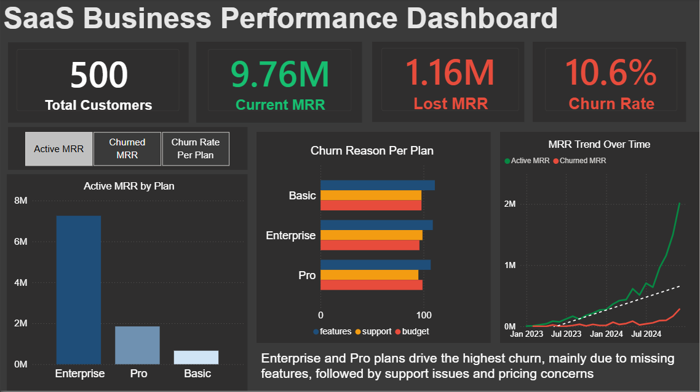

# SaaS Business Performance Dashboard

We're growing — but so is our churn problem.

Active MRR hit $9.76M, but we're losing $1.16M every month 
to churned customers. That's a 10.6% churn rate that's been 
climbing alongside our growth.

---

## What I looked at

- 500 customers across 3 subscription plans (Basic, Pro, Enterprise)
- Monthly Recurring Revenue — active vs churned over time
- Why customers are leaving and which plans are most affected

---

## What I found

- Enterprise is our biggest revenue driver, but also our biggest 
  churn problem — high value customers are leaving
- Our Active MRR is growing, but Churned MRR is growing with it.
  We're filling a leaking bucket
- The main reason customers leave is missing features, followed 
  by support issues, then pricing concerns — in that order

---

## My recommendations

1. Fix the product first — features are the #1 reason people leave,
   especially Enterprise customers who have specific needs
2. Support quality matters — it's the second biggest churn driver
   and it's something that can be fixed faster than the product
3. Review pricing — budget concerns are driving churn at 
   similar rates to support issues, especially in the 
   Basic and Pro plans

---

## Tools

Power BI | Excel

## Data source
[https://www.kaggle.com/datasets/rivalytics/saas-subscription-and-churn-analytics-dataset]

## Dashboard Screenshots

### Overview

